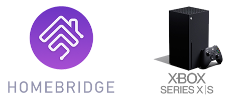
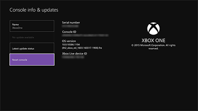

# Homebridge-Smartglass

This is a plugin for Homebridge that allows you to control your xbox console. The following features are supported:

- Turn on and off
- Show current active app using input sources
- Allows you to launch apps and games using the input switcher *
- Control volume on the Xbox Series *
- Remote control using the native IOS remote

\* *Requires to be logged in and have the console configured using the Xbox API.*

## Requirements:

- NodeJS >= 10.x
- Homebridge >= 1.2.0

## Installation instructions

Install the plugin:

    npm install -g homebridge-smartglass

## Config UI X / HOOBS instructions

1. Search for the plugin using `smartglass`
2. Install plugin and configure using the UI.

## Setting up the Xbox

The plugin needs to be allowed to connect to your Xbox. To allow this make sure you set the setting to allow anonymous connections in Settings -> Devices -> Connections on the Xbox.

## Authenticate with the Xbox API

When you authenticate with the Xbox api using your account, you can enable the api function to switch apps and have an improved poweron and poweroff functions.
After reloading homebridge, homebridge-smartglass will show instructions in the console on how to authenticate with the Xbox API. You can authenticatie via the following steps:

- Check the log output for an link that homebridge-smartglass provides on startup
- Authenticate with Homebridge-Smartglass to allow the application to authenticate with the Xbox API's
- After authenticaing you will get redirected. After the redirect copy the part after `?code=` from the url
- Add a new entry below `"liveid: "<liveid>",` with: `"apiToken": "<code>",` and restart homebridge
- Check the logs after the restart. The console will tell you if the authentication was successful or not 

Reload homebridge and you are done.

## Finding the liveid of your console

Go to settings -> Console info and the liveid is displayed right there.

## Homebridge configuration

Configure the Platform in your Homebridge config like below. Replace the ip address and liveid.

    "platforms": [
      {
        "platform": "Smartglass",
        "devices": [
          {
            "name": "Xbox Series S",
            "ipaddress": "192.168.2.9",
            "liveid": "F400000000000000",
            "inputs": [
              {
                "name": "Twitch",
                "aum_id": "TwitchInteractive.TwitchApp_7kd9w9e3c5jra!Twitch",
                "title_id": "442736763"
              },
              {
                "name": "Spotify",
                "aum_id": "SpotifyAB.SpotifyMusic-forXbox_zpdnekdrzrea0!App",
                "title_id": "1693425033"
              },
              {
                "name": "Youtube",
                "aum_id": "GoogleInc.YouTube_yfg5n0ztvskxp!App",
                "title_id": "122001257"
              },
              {
                "name": "Destiny 2",
                "aum_id": "Bungie.Destiny2basegame_8xb1a0vv8ay84!tiger.ReleaseFinal",
                "title_id": "144389848"
              }
            ]
          }
        ]
      }
    ]

| Key | Explanation |
|-----|-------------|
| `name` | The name of the accesory to appear in Homekit |
| `liveid` | This needs to contain your Xbox live id. You can get this live id in the console settings. |
| `ipaddress` | This needs to contain your xbox console ip. Best is to set a static ip on the console. |
| `inputs` | This part is optional. You can define extra apps here to show them in Homekit and you can launch then when you supply a title_id |

### Optional options

The plugin supports optional options for configuring the plugin.

| Key | Explanation |
|-----|-------------|
| `apiToken` | *(Optional)* After authenticating with the Xbox login url you need to paste in the token you get after the redirect in the url (`?code=<code>`) |
| `clientId` | *(Optional)* Provide an Azure AD clientId to use your own tenant for authentication |
| `clientSecret` | *(Optional)* Provide an Azure AD clientSecret related to the clientId to use your own tenant for authentication. Depends on app configuration if needed. |

### Known issues

- TV Controls can stop working after some usage. The client will reconnect when this happens.
